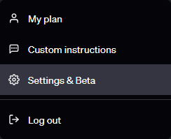
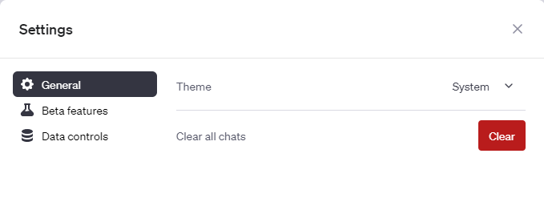
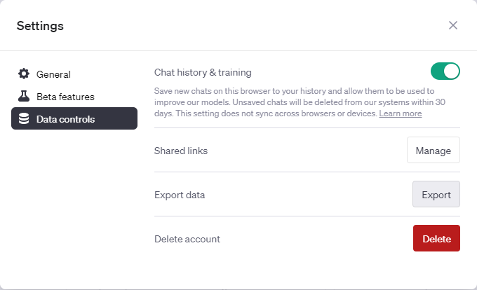
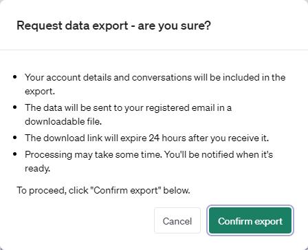

# Your entire ChatGPT data in beautiful Markdown 🚀

Welcome to the ChatGPT Conversations to Markdown converter! This Python script helps you to convert your entire ChatGPT history and data export into neatly formatted Markdown files.


It adds **YAML** headers, and also includes **Code interpreter** (Advanced Data Analysis) input / output.

#### See Examples : [Screenshot](demo/Fibonacci.png), [Markdown](demo/Fibonacci.md), [Markdown with dollar signs](demo/Fibonacci-dollar-signs.md), [Chat link](https://chat.openai.com/share/27b6df58-a590-41ac-9eff-f567602fe692).

## Quick setup

See [Prerequisites](#prerequisites).

### Step 1: Clone the Repository 📥

Open a terminal or command prompt and run the following command:

```bash
git clone https://github.com/mohamed-chs/chatgpt-history-export-to-md.git
```

Next, navigate to the project directory by using the following command:

```bash
cd ChatGPT-history-export-to-Markdown
```

### Step 2: Download Your Conversations data 🗂

Before you run the script, make sure your ChatGPT conversations are in a ZIP file format.

<details>
  <summary>Click to EXPAND instructions :</summary>
  
  1.  Sign in to ChatGPT at https://chat.openai.com

2.  At the bottom of the left side bar, click on your profile name, the on **Settings**

    

3.  Go to **Data controls**

    

4.  In the "Data Controls" menu, click on _Export data_ : **Export**

    

5.  In the confirmation modal click **Confirm export**

    

6.  You should get an email with your data, in 2 ~ 5 minutes (check your **inbox**)

    

7.  Click **Download data export** to download a `.zip` file containing your entire chat history and other data.

    

</details>

>

The script will automatically find the most recent ZIP file in your 'Downloads' directory (in `~/Downloads/`), but you can specify a different file or location if necessary.

### Step 3: Running the Script 🏃‍♂️

In the terminal or command prompt, run the script with this command:

```bash
python main.py
```

The default output location for the Markdown files is : `~/Documents/ChatGPT-Conversations/MD/`. The script will automatically create the directories if they didn't exist. Feel free to [customize](#optional-customize-the-scripts-behavior-🌟) the script's behavior.

### Step 4: Check the Output 🎉

And that's it! After running the script, check the output folder for your neatly formatted Markdown files.

### Optional: Customize the Script's behavior 🌟

#### command line parameters

Feel free to customize the script's behavior using additional parameters:

- `--out_folder`: Specify the output folder where the MD files will be saved.
- `--zip_file`: Specify the ZIP file containing the ChatGPT conversations to be converted.

Here is an example command:

```bash
python main.py --out_folder "Obsidian_Vault/Chats" --zip_file "My downloads/my_chat.zip"
```

This will extract and look for the `conversations.json` file in `~/My downloads/my_chat.zip`, and create the MD files in `~/Obsidian_Vault/Chats`.

(on **Windows**, `~/` refers to `C:/Users/{your_username}/`).

#### `config.json`

You can also modify the [config.json](config.json) file, to customize the output :

```json
{
  "system_title": "System",
  "user_title": "YOUR NAME", // Default : "Me"
  "assistant_title": "My AI", // Default : "ChatGPT"
  "tool_title": "Code output",
  "delimiters_default": true
}
```

Change `"delimiters_default"` to `false` to replace all $\LaTeX$ bracket delimiters : `\(...\)` and `\[...\]`, with dollar sign ones : `$...$` and `$$...$$`, if you'd like your math to render beautifully in Markdown readers that support **MathJax** (like Obsidian).

### Issues and contributions 🆘

Feel free to fork this repository and make your enhancements or improvements. ALL contributions are welcome !

If you encounter any issues or have questions, feel free to open a discussion [here](https://github.com/mohamed-chs/chatgpt-history-export-to-md/issues) or leave a comment on the Reddit post [here](https://www.reddit.com/r/ChatGPT/comments/16k1ub5/i_made_a_simple_chatgpt_history_to_markdown/).

### Enjoy Your Conversations in Markdown! 🎈

Hopefully, you find value in this tool. If you do, giving it a star ⭐ on the repository would mean a lot. Thank you!

### Prerequisites

 

Make sure you have **Python** (version >= 3.10), and **Git** installed.
You can download them from :

- [Official Python website](https://www.python.org/downloads/)
- [Official Git website](https://git-scm.com/downloads)

### Notes

This is just a small thing I coded to help me see my convos in beautiful markdown, in Obsidian (my note-taking app).

I wasn't a fan of the clunky, and sometimes paid, chrome extensions.

I'm working on automating it to add new conversations and updating old ones. Had some luck with a JavaScript bookmarklet, still ironing it out tho. Shouldn't take long.
