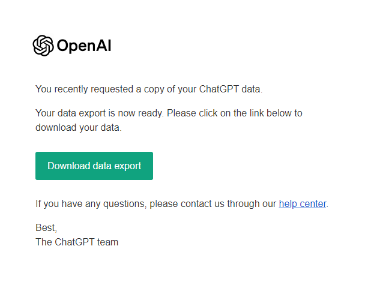
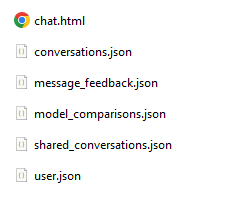

# Your entire ChatGPT data in beautiful Markdown 

## You can now also try out Word Clouds 🔡☁️ on your data, see graphs 📈 of your prompt history, and get all your custom instructions 🤖 in one place !


Welcome to the ChatGPT Conversations to Markdown converter! This Python script helps you to convert your entire ChatGPT history and data export into neatly formatted Markdown files.

It adds **YAML** headers (_optional, included by default_), and also includes **Code interpreter** (Advanced Data Analysis) input / output.

**New :** Data visualizations, and custom instructions.


#### See Examples : [Screenshot](assets/demo/Fibonacci.png), [Markdown](assets/demo/Fibonacci.md), Word clouds : [sample 1](assets/demo/wordcloud_sample.png) , [sample 2](assets/demo/wordcloud_sample2.png).

## Quick setup

> See [Prerequisites](#prerequisites). (Just Python and Git, and you're good to go.)

### Step 1: Clone the Repository 📥

Open a terminal or command prompt and run the following command:

```bash
git clone https://github.com/mohamed-chs/chatgpt-history-export-to-md.git
```

Next, navigate to the project directory by using the following command:

```bash
cd chatgpt-history-export-to-md
```

### Step 2: Set Up the Environment 🛠️

Before running the script, you need to set up a virtual environment and install the required dependencies.

First, create a virtual environment:

```bash
python -m venv .venv
```

Activate the virtual environment:

#### On Windows:

Using Command Prompt (`cmd.exe`):

```bash
.venv\Scripts\activate.bat
```

Or, if you're using PowerShell:

```powershell
.venv\Scripts\Activate.ps1
```

If you encounter an error about script execution in PowerShell, try running:

```powershell
powershell -ExecutionPolicy ByPass -File .venv\Scripts\Activate.ps1
```

#### On Linux or MacOS:

```bash
source .venv/bin/activate
```

After activation, install the necessary packages using:

```bash
pip install -r requirements.txt
```

### Step 3: Download Your Conversations data 🗂

Before you run the script, make sure your ChatGPT conversations are in a ZIP file format.

<details id="download-instructions">
  <summary>How to download : (click to expand/collapse)</summary>

<hr>
  
1.  Sign in to ChatGPT at https://chat.openai.com

2.  At the bottom of the left side bar, click on your profile name, the on **Settings**

    

3.  Go to **Data controls**

    

4.  In the "Data Controls" menu, click on _Export data_ : **Export**

    

5.  In the confirmation modal click **Confirm export**

    

6.  You should get an email with your data, in 2 ~ 5 minutes (check your **inbox**)

    

7.  Click **Download data export** to download a `.zip` file containing your entire chat history and other data.

    

    [↑ Collapse](#download-instructions)

</details>

<hr>

The script will automatically find the most recent ZIP file in your 'Downloads' directory (in `~/Downloads/`), but you can specify a different file or location if necessary.

### Step 4: Running the Script 🏃‍♂️

With the environment set up, you can now run the script. In the terminal or command prompt, execute:

```bash
python main.py
```

Now, follow the instructions on screen and choose your desired options, the script will handle the rest.

### Step 5: Check the Output 🎉

And that's it! After running the script, head over to the output folder to see your nice word clouds, graphs, and neatly formatted Markdown files. Enjoy !

_tweet your data findings_

[](https://twitter.com/intent/tweet?text=So%2C%20this%20is%20what%20my%20entire%20ChatGPT%20history%20looks%20like%20...%0D%0A%0D%0Ahttp%3A%2F%2Fbit.ly%2F3ZuHCCK)

### Share Your Feedback! 💌

I hope you find this tool useful. I'm continuously looking to improve on this, but, I need your help for that.

Whether you're a tech wizard or you're new to all this (especially if you're new to all this), I'd love to hear about your journey with the tool. Found a quirk? Have a suggestion? Or just want to send some good vibes? I'm all ears!

**Here's how you can share your thoughts:**

1. **GitHub Issues**: For more specific feedback or if you've stumbled upon a bug, please open an [issue](https://github.com/mohamed-chs/chatgpt-history-export-to-md/issues). This helps me track and address them effectively.

2. **GitHub Discussions**: If you just want to share your general experience, have a suggestion, or maybe a cool idea for a new feature, jump into the [discussions](https://github.com/mohamed-chs/chatgpt-history-export-to-md/discussions) page. It's a more casual space where we can chat.

And if you've had a great experience, consider giving the project a star ⭐. It keeps me motivated and helps others discover it!

Thank you for being awesome! 🌟

## Acknowledgments 🙌

Massive shout-out to some incredible tools that made this project come to life:

- **matplotlib** ([repo](https://github.com/matplotlib/matplotlib)) for those crisp visuals.
- **nltk** ([repo](https://github.com/nltk/nltk)) for the NLP magic.
- **pandas** ([repo](https://github.com/pandas-dev/pandas)) – because who can handle data without it?
- **questionary** ([repo](https://github.com/tmbo/questionary)) for those sleek command line interactions.
- **seaborn** ([repo](https://github.com/mwaskom/seaborn)) for taking my plots up a notch.
- **wordcloud** ([repo](https://github.com/amueller/word_cloud)) for those awesome cloud visualizations.

Thanks to these projects and their contributors for the hard work that went into developing these invaluable tools!

### Contributions 🆘

Feel free to fork this repository and make your enhancements or improvements. ALL contributions are welcome !

> See [CONTRIBUTING.md](CONTRIBUTING.md)

> See also : [my HackerNews post](https://news.ycombinator.com/item?id=37636701)

### Prerequisites

 

Make sure you have **Python**, and **Git** installed.
You can download them from :

- [Official Python website](https://www.python.org/downloads/)
- [Official Git website](https://git-scm.com/downloads)

### Notes

This is just a small thing I coded to help me see my convos in beautiful markdown, in [Obsidian](https://obsidian.md/) (my note-taking app).

I wasn't a fan of the clunky, and sometimes paid, chrome extensions.

I'm working on automating it to add new conversations and updating old ones. Had some luck with a JavaScript bookmarklet, still ironing it out tho. Shouldn't take long.

> See [TODO](TODO.md).

> If you want the last working version with absolutely no external dependencies (no virtual environment needed), you can find it [here](https://github.com/mohamed-chs/chatgpt-history-export-to-md/tree/fe13a701fe8653c9f946b1e12979ce3bfe7104b8).
